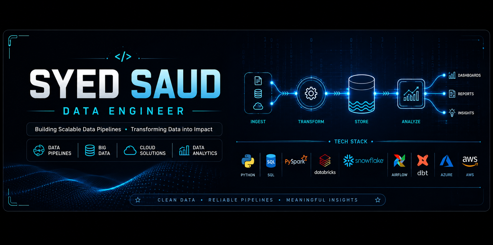

<p align="center">
  
</p>

<br>

<div align="center">


</div>

<div align="center">

# 👋 Welcome to My GitHub

### Building Modern Data Engineering Solutions


</div>

---

<div align="center">

<a href="https://github.com/syedsaud15">

</a>


<a href="https://github.com/syedsaud15?tab=repositories">

</a>

<a href="https://www.linkedin.com/in/syed-saud-alam">

</a>

</div>

---

# 💎 About Me


### Hello 👋

I'm **Syed Saud**, an aspiring **Data Engineer** passionate about designing scalable data solutions and transforming raw data into meaningful insights.

I enjoy working on modern data platforms and continuously improving my skills in distributed computing, cloud technologies, and AI-powered applications.

---

## 🚀 Currently Working On

- End-to-End Data Engineering Projects
- PySpark & Apache Spark
- Databricks Lakehouse
- Snowflake Data Warehouse
- Apache Airflow
- dbt
- Azure Data Engineering
- AWS Data Services
- AI + Data Engineering

---

## 🎯 2026 Goals

- ✅ Master Data Engineering
- ✅ Build Enterprise Projects
- ✅ Learn Streaming Pipelines
- ✅ Open Source Contributions
- ✅ Crack Product Company Interviews
- ✅ Build AI Powered Data Pipelines

---

# ⚡ Tech Universe

<table>

<tr>

<td align="center">

### 💻 Languages


</td>

<td align="center">

### ☁ Cloud


</td>

</tr>

<tr>

<td align="center">

### ⚙ Development


</td>

<td align="center">

### 📊 Analytics


</td>

</tr>

</table>

---

# 📈 GitHub Analytics

<div align="center">


</div>

<div align="center">


</div>

---

# 💼 Core Expertise

```text
✔ SQL

✔ Python

✔ PySpark

✔ Apache Spark

✔ Databricks

✔ Snowflake

✔ dbt

✔ Apache Airflow

✔ Power BI

✔ Azure

✔ AWS

✔ Git

✔ GitHub

✔ ETL

✔ Data Warehousing

✔ Data Modeling

✔ AI Integration
```

---

# 🚀 Featured Projects

<div align="center">

<table>

<tr>

<td width="50%">

### 🏗 End-to-End Data Engineering Pipeline

A complete modern data engineering project covering ingestion, transformation, orchestration and visualization.

**Tech Stack**

`Python` `PySpark` `Databricks` `Snowflake` `Airflow` `Power BI`

</td>

<td width="50%">

### ⚡ Databricks Medallion Architecture

Bronze → Silver → Gold architecture using Delta Lake for scalable analytics.

**Tech Stack**

`Databricks` `Delta Lake` `Spark SQL`

</td>

</tr>

<tr>

<td width="50%">

### ❄ Snowflake + dbt + Airflow

Modern ELT pipeline with automated transformations.

**Tech Stack**

`Snowflake` `dbt` `Airflow`

</td>

<td width="50%">

### 📊 Power BI Dashboard

Interactive business dashboard with KPIs and drill-down analytics.

**Tech Stack**

`Power BI` `SQL`

</td>

</tr>

<tr>

<td width="50%">

### 🤖 AI RAG Chatbot

Retrieval-Augmented Generation chatbot using LLMs.

**Tech Stack**

`Python` `LangChain` `Gemini`

</td>

<td width="50%">

### 🐍 PySpark Practical Repository

Collection of real-world PySpark examples and transformations.

**Tech Stack**

`Python` `PySpark`

</td>

</tr>

</table>

</div>

---

# 🛠 Technologies I Work With

<div align="center">


</div>

---

# 📚 Learning Journey

```text
2025

██████████████████████

SQL

Python

Git

GitHub

Power BI


2026

██████████████████████

Apache Spark

PySpark

Databricks

Snowflake

dbt

Apache Airflow

Azure

AWS

AI

LangChain

RAG
```

---

# 🏆 Certifications & Training

✅ SQL Development

✅ Python Programming

✅ Git & GitHub

✅ Power BI

✅ Hadoop Fundamentals

✅ Apache Spark

✅ PySpark

✅ Databricks

✅ Snowflake

✅ dbt

✅ Apache Airflow

✅ Azure Data Engineering (Learning)

✅ AWS Data Engineering (Learning)

---

# 📊 Development Workflow

```text
Raw Data

↓

SQL

↓

Python

↓

PySpark

↓

Databricks

↓

Snowflake

↓

dbt

↓

Airflow

↓

Power BI Dashboard

↓

Business Insights
```

---

# 💡 Philosophy

> **"Data is valuable only when it is transformed into actionable insights through scalable engineering."**

---

# 📌 Current Focus

- Building Production Ready Data Pipelines
- Cloud Data Engineering
- Modern Data Stack
- Distributed Data Processing
- Open Source Contributions
- AI + Data Engineering
- Portfolio Projects
- Interview Preparation

---

---

# 🏆 GitHub Achievements

<div align="center">


</div>

---

# 📊 Contribution Graph

<div align="center">


</div>

---

# 📈 GitHub Summary

<div align="center">


</div>

---

# 🌍 Open Source Mindset

```text
✔ Learn
      ↓
✔ Build
      ↓
✔ Share
      ↓
✔ Improve
      ↓
✔ Contribute
      ↓
✔ Repeat
```

---

# 📂 Repository Standards

Every repository follows:

✅ Professional Documentation

✅ Clean Folder Structure

✅ README

✅ Architecture Diagram

✅ Screenshots

✅ Installation Guide

✅ Usage Guide

✅ Future Improvements

✅ License

---

# 🎯 2026 Roadmap

| Quarter | Goal |
|----------|------|
| Q1 | SQL + Python Mastery |
| Q2 | Spark + Databricks + Snowflake |
| Q3 | Azure + AWS + Airflow |
| Q4 | Enterprise Projects + Open Source |

---

# 🌐 Connect With Me

<div align="center">

<a href="https://www.linkedin.com/in/syed-saud-alam">

</a>

&nbsp;&nbsp;&nbsp;

<a href="mailto:saudhere15@gmail.com">

</a>

&nbsp;&nbsp;&nbsp;

<a href="https://github.com/syedsaud15">

</a>

</div>

---

# 💬 Favorite Quote

<div align="center">

> **"Great data engineering isn't about moving data. It's about building systems people can trust."**

</div>

---

<div align="center">

### ⭐ If you like my work, consider following my journey!


</div>

---

# 🐍 Contribution Snake

<div align="center">


</div>

---
