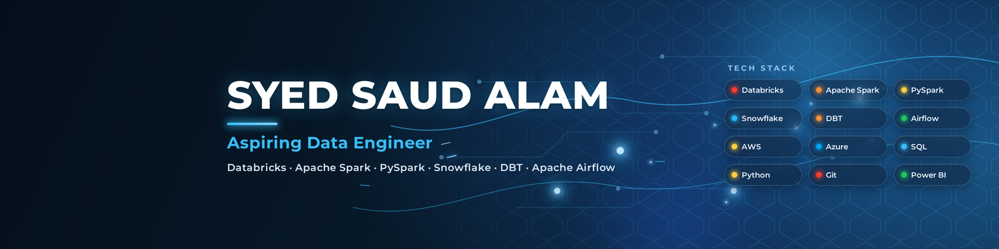

# 👋 Hi, I'm Syed Saud Alam

### Aspiring Data Engineer

  

 

💡 Passionate about building scalable ETL pipelines and modern cloud-based data platforms.

---

## 👨‍💻 About Me

- 🎓 MCA Student | BCA Graduate
- 💼 Aspiring Data Engineer passionate about Big Data & Cloud Technologies
- 🔥 Hands-on experience with Databricks, Apache Spark, PySpark, Snowflake, DBT and Apache Airflow
- ☁️ Built end-to-end ETL & Data Engineering projects using AWS S3 and SQL
- 📊 Interested in Data Engineering, Data Warehousing and Analytics
- 🚀 Continuously learning modern Data Engineering technologies

- ---

## 🛠️ Tech Stack

  

---

## 🚀 Featured Data Engineering Projects

<table>
<tr>

<td width="33%">

### 🏭 FMCG Lakehouse Pipeline

**Tech:** Databricks • PySpark • SQL • AWS S3

✔ Medallion Architecture

✔ Bronze → Silver → Gold

✔ ETL Pipeline

✔ Delta Lake

</td>

<td width="33%">

### 🚖 OLA Ride Analytics

**Tech:** Databricks • SQL • Power BI

✔ Data Cleaning

✔ ETL Pipeline

✔ Analytics Dashboard

✔ Business Insights

</td>

<td width="33%">

### ❄ Snowflake ELT Pipeline

**Tech:** Snowflake • DBT • Airflow

✔ Automated Workflows

✔ Data Transformation

✔ Testing

✔ Scheduling

</td>

</tr>
</table>

---

---

## 📊 GitHub Analytics

