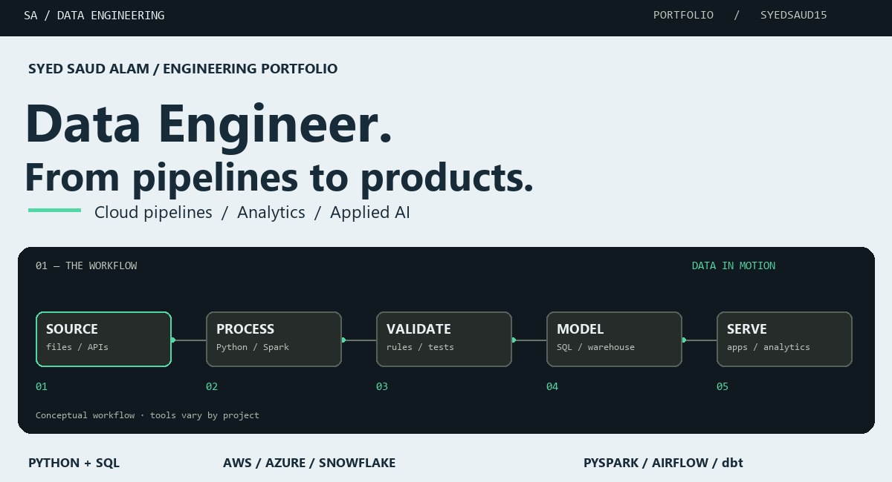
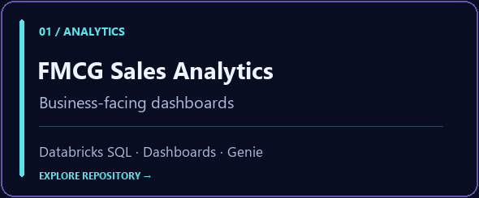
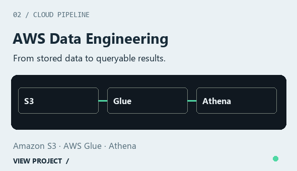
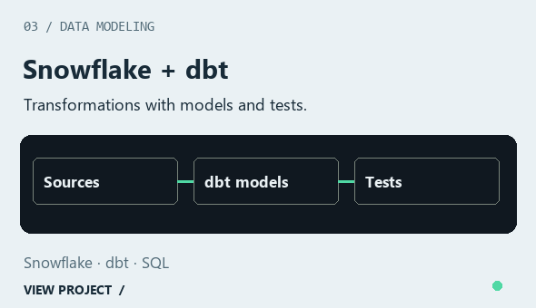
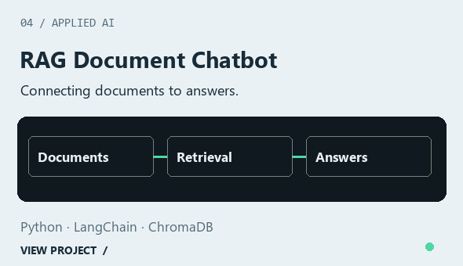
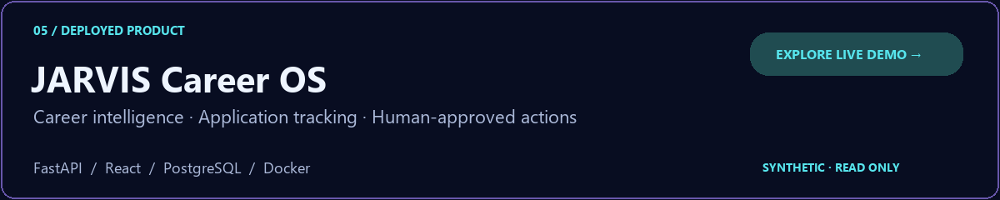

  

  <strong>Python & SQL · Cloud data pipelines · Analytics engineering · Applied AI</strong>

  <a href="https://syedsaud15.github.io/syed-saud-portfolio/">Portfolio ↗</a> &nbsp; / &nbsp;
  <a href="#selected-work">Selected work</a> &nbsp; / &nbsp;
  <a href="https://jarvis-career-os.onrender.com/demo">JARVIS live demo ↗</a>

---

<a href="assets/profile-header.png">View static header</a> · Data engineering / Analytics / Applied AI

## Turning raw data into useful products

I'm **Syed Saud Alam**, a Data Engineer building a project portfolio across cloud data pipelines, analytics and AI-enabled applications.

My work connects **data ingestion, transformation and modeling** with the dashboards and applications that make the results useful. I work with Python and SQL, explore modern platforms such as Databricks and Snowflake, and document the decisions behind each project.

**What I care about:** understandable data flows, testable transformations, explicit limitations and useful outcomes—not just a long list of tools.

## Selected work

  
  

  
  

**Browse:** [Databricks analytics](https://github.com/syedsaud15/FMCG-Sales-Analytics-Databricks) · [AWS pipeline](https://github.com/syedsaud15/aws-end-to-end-data-engineering-project) · [Snowflake + dbt](https://github.com/syedsaud15/snowflake-dbt-data-engineering) · [RAG chatbot](https://github.com/syedsaud15/RAG-Document-Chatbot)

These are portfolio projects. Repository documentation describes each project's implementation and scope; the technologies above are not claims of commercial deployment experience.

### Spotlight / JARVIS Career OS

A full-stack career workspace that brings discovery, preparation and application tracking together.

- **Explainable assistance:** heuristic resume–job fit signals, skill-gap guidance and interview-preparation drafts.
- **User control:** explicit approval before Gmail or Calendar actions in the protected workspace.
- **Data boundaries:** a synthetic, read-only public demo separate from private career APIs.
- **Verification:** backend tests, frontend lint/build, browser workflows and container access checks in CI.
- **Recovery:** versioned career-data exports and restore into a separate local database.

**[Explore the public demo →](https://jarvis-career-os.onrender.com/demo)**

The source repository is private. The demo contains sample data, not a public signup service or real user accounts.

## Technology focus

**Languages & processing**

**Cloud & analytics platforms**

**Applications & persistence**

**Delivery & engineering workflow**

Applied AI projects also use **LangChain, ChromaDB and retrieval-augmented generation**. These groups describe tools used across projects, not a single architecture requiring every tool.

## How I approach a build

**Define the question → understand the source → transform and validate → model → serve → document.**

- Start with the intended consumer and the question the data must answer.
- Make assumptions, schema decisions and transformation logic visible.
- Test important behavior and keep sample data separate from private data.
- Document setup, trade-offs and recovery steps alongside the code.
- Treat a working demo as a milestone—not proof of unlimited scale or reliability.

## Continuing to deepen

Data modeling, Spark transformations, warehouse testing and dependable cloud workflows are my continuing focus. I also explore where AI assistance adds value without replacing clear data contracts and human review.

## Explore & connect

**[Portfolio](https://syedsaud15.github.io/syed-saud-portfolio/)** · **[Public repositories](https://github.com/syedsaud15?tab=repositories)** · **[Interactive project demo](https://jarvis-career-os.onrender.com/demo)**

I welcome conversations about data engineering, analytics engineering and building useful applications around data.

---

Build with intent. Validate with evidence. Document the trade-offs.

